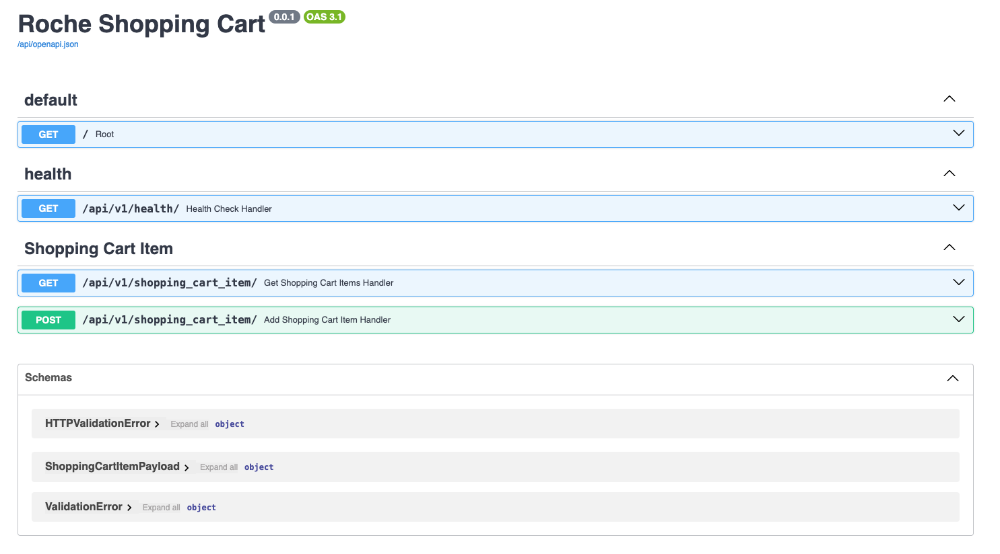

# roche-shopping-cart
Backend services for Roche Shopping Cart

[](https://docs.python.org/3/)
[](https://fastapi.tiangolo.com/)
[](https://www.openapis.org/)
[](https://swagger.io/)
[](https://black.readthedocs.io/en/stable/)
[](https://docs.pydantic.dev/)


## Development

Requirements:
  - [docker](https://www.docker.com/)
  - [docker-compose](https://docs.docker.com/compose/)
  - [make](https://www.gnu.org/software/make/manual/html_node/Introduction.html)

### Setup

```bash
git clone https://github.com/liman4u/roche-shopping-cart.git

cd roche-shopping-cart

cp .env-example .env

make setup
```

### Run API
```bash

make run-api
```

### Run Test
```bash

make test
```


## API

Available API [docs](http://localhost:8000/docs)


| Method | Endpoint                      | Description                                                                  |
| ------ | ----------------------------- | -----------------------------------------------------------------------------|
| GET    | /api/v1/health                 | Check if service is healthy                                                  |
| POST   | /api/v1/shopping_cart_item | Add item to shopping cart call reservation service to run in the background for reserving cart item                         |
| GET    | /api/v1/shopping_cart_item                      | Get all cart items                                           |



# Dependencies

- FastAPI - Writing restful api(requests and responses)

- Pytest - Writing tests

- Coverage - Checking coverage of code tested

- Flake8 - Combines pep8 and pyflakes for linting

- Black - Great tool for formatting

- Dependency Injector - Managing and injection of initialised service and repository

- Structlog - Logging

- AIOHttp - Making client calls


## What more can be done.
1. User authentication and authorization to protect routes
2. Pagination when getting all shopping cart items to limit data size
3. Rate limiting for the APIs to prevent attack like DDOS
4. Integration Tests to test API with external service
5. Making use of Celery for long running background task
6. Dockerfile for production and CI/CD workflows for building and deployment of docker images.
7. Sufficient unit tests
8. Fixing of `emit_reserve_cart_item` unit tests, marked with x_, so it does not run - was getting issue with host of wiremock in test

## References
1. [FastAPI official docs](https://fastapi.tiangolo.com/)
2. [Dependency Injector](https://python-dependency-injector.ets-labs.org/)
3. [Clean Architecture](https://blog.cleancoder.com/uncle-bob/2012/08/13/the-clean-architecture.html)
